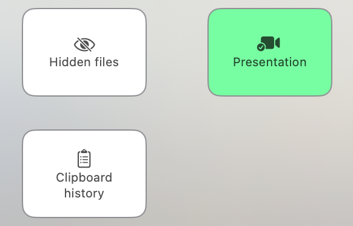

# MacUtilityTools

 

## Features

- Hide / Show hidden files
  - On : Hidden files will be visible.
  - Off : Hidden files will be invisible.

- Enable / Disable presentation mode
  - On : Desktop folders / files will be invisible.
  - Off : Desktop folders / files will be visible.

## Screenshots

